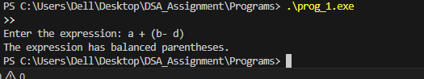
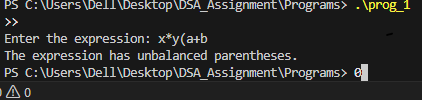

Balanced Parentheses Checker in C

#Aim
To write a C program that checks if an expression has balanced parentheses using a stack.

#Theory
Balanced parentheses mean every opening bracket has a matching closing bracket in the correct order.

We have three types of brackets:

() → round brackets

{} → curly brackets

[] → square brackets

A stack is perfect for this problem because it works on Last In, First Out (LIFO):

-Push opening brackets onto the stack.
-Pop from the stack when a closing bracket appears.
-At the end, if the stack is empty → the expression is balanced.
-If not → it’s unbalanced.

Stack structure
This program uses a simple array to implement the stack:

#define MAX 100
char stack[MAX];  // array to store brackets
int top = -1;     // index of the top element

-stack[] → stores brackets ((, {, [)
-top → keeps track of the last element in the stack
-MAX → maximum number of elements the stack can hold
This stack allows us to push opening brackets and pop them when a closing bracket appears.

#Program Functions

1.push(char c) – Adds a bracket to the stack.
2.pop() – Removes the top bracket from the stack.
3.match(char a, char b) – Checks if two brackets are matching.
4.checkBalanced(char exp[]) – Iterates through the expression and uses the stack to check if it’s balanced.

#Algorithm
1.Start with an empty stack (top = -1)

2.For each character in the expression:
If it’s an opening bracket → push it onto the stack
If it’s a closing bracket →
   If stack is empty → expression is unbalanced
   Else → pop top of stack and check if it matches

3.After processing all characters:
  If stack is empty → Balanced
  Else → Unbalanced

#Sample Output
*example A*

 
*example B*

#Result
The program correctly identifies whether a given expression has balanced parentheses using a stack.

#Conclusion
Using a stack with an array is an easy and reliable way to check balanced parentheses.
-Works for round, curly, and square brackets
-Ensures correct pairing and order
