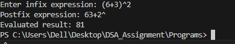
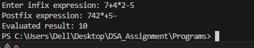

Infix to Postfix Conversion and Evaluation Using C

# Aim

To create a C program that transforms an infix expression into postfix form and computes the result using stack data structures.

# Theory

Infix Expression: A normal mathematical expression where the operator is placed between operands, for example A + B.

Postfix Expression (Reverse Polish Notation): The operator comes after the operands, for example AB+.

How Conversion Works (Infix → Postfix):

- A stack is used to temporarily hold operators.

- Operands (numbers or variables) are added directly to the postfix expression.

- Operators are pushed to the stack according to their priority.

- Parentheses help control the order in which operations are performed.

Evaluating Postfix Expressions:

- A stack of integers is used to calculate the result.

- Operands are pushed onto the stack.

- When an operator is encountered, two numbers are popped, the operation is performed, and the result is pushed back.

- The final number remaining in the stack is the result.

# Operator Priority:

Operator	Priority
^	3
* /	2
+ -	1

#Stack Definitions

#define MAX 50

typedef struct {
    char data[MAX];
    int top;
} CharStack;

typedef struct {
    int data[MAX];
    int top;
} IntStack;

- CharStack is used for operators during infix to postfix conversion.

- IntStack is used for numbers during postfix evaluation.

- top keeps track of the current top element of the stack.

# Program Description

The program does the following:

1. Reads an infix expression from the user.

2. Converts it into postfix notation using infixToPostfix.

3. Evaluates the postfix expression using evaluatePostfix.

4. Displays the postfix expression and the final result.

# Functions in the Program:

initCharStack / initIntStack → Initialize stacks.

pushChar / popChar / peekChar → Stack operations for operators.

pushInt / popInt → Stack operations for numbers.

precedence(char op) → Returns the operator’s priority.

infixToPostfix(char infix[], char postfix[]) → Converts infix to postfix.

evaluatePostfix(char postfix[]) → Evaluates the postfix expression.

# Algorithm

Infix to Postfix Conversion:

1. Start with an empty operator stack.

2. Read each character of the infix expression:

  If it is a number, add it directly to the postfix expression.

  If it is '(', push it onto the stack.

  If it is ')', pop operators until '(' is found.

  If it is an operator, pop operators with higher or equal priority, then push the current operator.

3. After processing all characters, pop any remaining operators from the stack and add them to postfix.

Postfix Evaluation:

1. Start with an empty integer stack.

2. Read each character of the postfix expression:

   If it is a number, push it onto the stack.

   If it is an operator, pop two numbers, perform the operation, and push the result back.

3. The last value in the stack is the final answer.

# Sample Output

Example 1:

Example 2:
 

# Result

The program is able to convert any valid infix expression into postfix and calculate its result correctly using stacks.

# Conclusion

Using stacks makes it easier to handle operators and numbers in expressions. This program demonstrates:

- Proper operator precedence and associativity.

- Efficient evaluation of expressions using Last In First Out (LIFO) logic.

- How computers can evaluate expressions without manually checking parentheses or operator order.