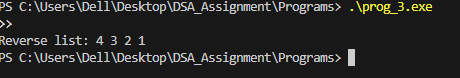

# Reverse Traversal of a Singly Linked List in C

# Aim

To write a C program that prints the elements of a singly linked list in reverse order using recursion, without changing the original list.

# Theory

A singly linked list is a collection of nodes where each node contains:

- Data: The value stored in the node.

- Next Pointer: Points to the next node in the list.

A node is the basic unit of a linked list. Nodes are connected together to form a list. The last node points to NULL, which shows the end of the list.

In reverse traversal, the list is printed from the last node to the first node.
Using recursion, the program first goes to the end of the list and then prints each node as the function comes back, without changing the original list.

# Data Structure / Node Definition

struct Node {

    int data;

    struct Node* next;

};

-data stores the value of the node.

-next points to the next node in the list.

Nodes can store any type of data and are created dynamically using malloc. Linking nodes together forms the linked list.

# Program Description

The program does the following:

1. Creates a singly linked list using addNode.

2. Prints the list in reverse order using the recursive function printReverse.

3. Prints all elements from the last node to the first node without modifying the list.

Functions in the program:

- createNode(int data) → Makes a new node with the given value.

- addNode(&head, data) → Adds a new node at the end of the list.

- printReverse(head) → Prints the list in reverse order using recursion.

# Algorithm

Adding a Node:

1. Create a new node.

2. If the list is empty, make the new node the head.

3. therwise, go to the last node.

4. Attach the new node at the end.

Reverse Traversal:

1. If the current node is NULL, return.

2. Call the function again on the next node.

3. Print the current node’s data when coming back from recursion.

- This makes the last node print first, then the previous nodes, until the first node is printed last.

# Sample Output

example:

# Result

The program successfully prints a singly linked list in reverse order using recursion without changing the original list.

# Conclusion

Recursion provides a simple way to print a linked list in reverse.
We do not need to reverse the list itself. The program prints the elements from tail to head using the function’s return steps.
This helps to understand linked lists and recursion in a simple and easy way.
