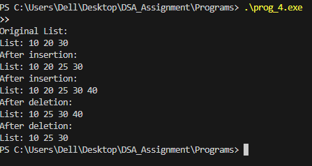

# Implementation of Doubly Linked List Using `typedef` Structure in C

---

### Aim

To implement a **doubly linked list** in C using `typedef` structure and to write functions to:

1. Insert a node **after a given node**.
2. Delete a specified node.  
The program demonstrates all operations using function calls.

---

### Theory

A **doubly linked list** is a dynamic data structure consisting of nodes where each node contains:

- **Data**: The actual value stored in the node.
- **Prev Pointer**: Points to the previous node in the list.
- **Next Pointer**: Points to the next node in the list.

Unlike a singly linked list, a doubly linked list allows **traversal in both directions**.  

Operations:

- **Insertion after a node**: Adds a new node after a specified node.
- **Deletion of a node**: Removes a specified node and updates pointers of adjacent nodes.
- **Traversal**: Iterates through the list to display all node values.

---

### Data Structure / Node Definition

```c
typedef struct Node {
    int data;
    struct Node* prev;
    struct Node* next;
} Node;
````

* `data`: Stores the value of the node.
* `prev`: Pointer to the previous node.
* `next`: Pointer to the next node.

---

### Definition of Program

The program performs the following operations:

1. Creates a doubly linked list with three nodes containing values 10, 20, and 30.
2. Displays the original list.
3. Inserts new nodes after specified nodes and displays the updated list.
4. Deletes specified nodes and displays the updated list after each deletion.

Functions used:

* `createNode(int data)`: Creates a new node with the given data.
* `insertAfter(Node* prevNode, int data)`: Inserts a node after a given node.
* `deleteNode(Node** head, Node* delNode)`: Deletes a specified node from the list.
* `printList(Node* node)`: Traverses and prints the list from head to tail.

---

### Algorithm

**Insertion After a Node:**

1. Check if the previous node is `NULL`. If yes, return an error.
2. Create a new node.
3. Set `newNode->next = prevNode->next`.
4. Set `newNode->prev = prevNode`.
5. Update `prevNode->next->prev` if it exists.
6. Set `prevNode->next = newNode`.

**Deletion of a Node:**

1. Check if the node to delete or head is `NULL`. If yes, return.
2. If node to delete is head, update `head = delNode->next`.
3. Update `delNode->next->prev` and `delNode->prev->next` if they exist.
4. Free memory of the node.

**Traversal:**

* Start from head.
* Print `data` of each node while moving to `next` until the end of the list.

---

### Sample Output



---

### Result

The program successfully implements a doubly linked list and demonstrates insertion and deletion operations while maintaining correct links between nodes.

---

### Conclusion

Doubly linked lists provide **flexible and efficient manipulation** of dynamic data, allowing insertion and deletion at any position in O(1) time if the node pointer is known. They are more versatile than singly linked lists due to **bi-directional traversal**.

---