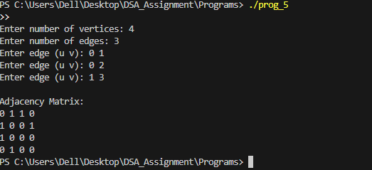

# Implementation of an Undirected Graph Using Adjacency Matrix in C

# Aim

To implement an undirected graph using an adjacency matrix in C and display the connections between vertices.

# Theory

- A graph is a collection of vertices (nodes) connected by edges.

- An adjacency matrix is a 2D array where:

  adj[i][j] = 1 → There is an edge between vertex i and vertex j.

  adj[i][j] = 0 → No edge exists between i and j.

- For an undirected graph, the matrix is symmetric, meaning adj[i][j] = adj[j][i].

# Data Structure / Array Definition

#define MAX 10

int adj[MAX][MAX];   // Adjacency matrix

int n;               // Number of vertices

int visited[MAX];    // Optional, can be used in traversals

- adj[][] → Stores edges between vertices.

- n → Number of vertices in the graph.

# Program Description

The program:

- Reads the number of vertices n.

- Initializes the adjacency matrix to 0.

- Reads the number of edges.

- Accepts edges (u v) from the user and updates the adjacency matrix:

  adj[u][v] = 1

  adj[v][u] = 1 (for undirected graph)

- Prints the adjacency matrix, showing all connections.

# Algorithm

1. Put the number of vertices n.

2. Initialize all entries of the adjacency matrix to 0.

3. Input the number of edges edges.

4. For each edge:

- Input vertices u and v.

- Set adj[u][v] = 1 and adj[v][u] = 1.

5. Print the adjacency matrix.

# Sample Output

example:

# Explanation:

- Row i shows which vertices i is connected to.

- 1 → There is an edge, 0 → No edge.

# Result

The program successfully stores and displays an undirected graph using an adjacency matrix.

# Conclusion

Adjacency matrices provide a simple way to represent graphs.

They allow quick checks for the existence of an edge between any two vertices.

Useful for small graphs and for implementing graph algorithms like BFS and DFS later.