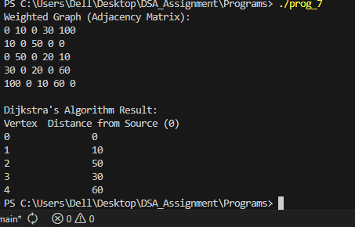

#  Documentation: Dijkstra's Algorithm for Shortest Path in Weighted Graph

##   Data Structure Definition

- The graph is represented using an **adjacency matrix**:  
  `graph[i][j]` = weight of the edge between vertex `i` and `j`  
  `0` indicates no direct edge between the vertices  

- `dist[]` → Stores the shortest distance from the **source** vertex to each vertex  
- `visited[]` → Marks whether a vertex has been included in the shortest path tree  

---

##  Functions Implemented

### `minDistance(int dist[], int visited[], int n)`
- Finds the **unvisited vertex with the minimum distance**  
- Returns the index of this vertex  

### `dijkstra(int graph[MAX_VERTICES][MAX_VERTICES], int n, int source)`
- Implements **Dijkstra's Algorithm**  
- Initializes all distances to **infinity**, except the source (0)  
- Repeatedly selects the vertex with the smallest tentative distance and updates distances of its neighbors  
- Prints the shortest distance from the source to all vertices  

---

## Overview of `main()` Function

1. Defines a **weighted graph** as a 5x5 adjacency matrix  
2. Sets the **source vertex** (0 in this example)  
3. Displays the adjacency matrix  
4. Calls `dijkstra()` to compute shortest paths from the source  

---

## Sample Output

---

##  Conclusion

- The program efficiently finds the **shortest path from a single source** to all other vertices  
- Uses an adjacency matrix representation for weighted graphs  
- Human-friendly variable names (`dist`, `visited`, `source`) and comments make it easy to follow  
- Dijkstra’s algorithm guarantees correct shortest distances for **non-negative weights**