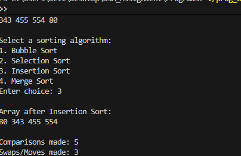

# Sorting Algorithm Comparison Program - Documentation

## Data Structures

### Arrays
- **`numbers[]`**: Stores original randomly generated integers (dynamically allocated)
- **`sortedArr[]`**: Copy of numbers array for sorting (dynamically allocated)
- **`leftArr[]`, `rightArr[]`**: Temporary arrays for merge operation in Merge Sort

### Variables
- **`num`**: Number of elements to generate
- **`compCount`**: Total comparisons counter
- **`swapCount`**: Total swaps/moves counter
- **`option`**: User's algorithm choice (1-4)

---

## Functions

### 1. `bubbleSort(int data[], int size, int *comp, int *swap)`
Compares adjacent elements and swaps if out of order. Largest elements bubble to the end through nested loops.

### 2. `selectionSort(int data[], int size, int *comp, int *swap)`
Finds minimum element from unsorted portion and swaps with first unsorted position.

### 3. `insertionSort(int data[], int size, int *comp, int *swap)`
Builds sorted array by inserting each element into correct position, shifting others as needed.

### 4. `performMergeSort(int data[], int start, int end, int *comp, int *swap)`
Recursively divides array into halves and merges them back in sorted order.

### 5. `mergeArrays(int data[], int start, int middle, int end, int *comp, int *swap)`
Helper function that merges two sorted subarrays into one sorted array.

### 6. `printArray(int data[], int size)`
Displays array elements separated by spaces.

---

## Main Function Flow

1. **Input**: Get number of elements from user
2. **Allocation**: Allocate memory for arrays using malloc
3. **Generation**: Generate random numbers [1-1000] using rand()
4. **Display**: Print original array
5. **Selection**: Show menu and get user's sorting choice
6. **Copy**: Copy original array to sortedArr
7. **Sort**: Execute chosen algorithm with switch-case
8. **Output**: Display sorted array, comparisons, and swaps
9. **Cleanup**: Free allocated memory

---

## Sample Output  

